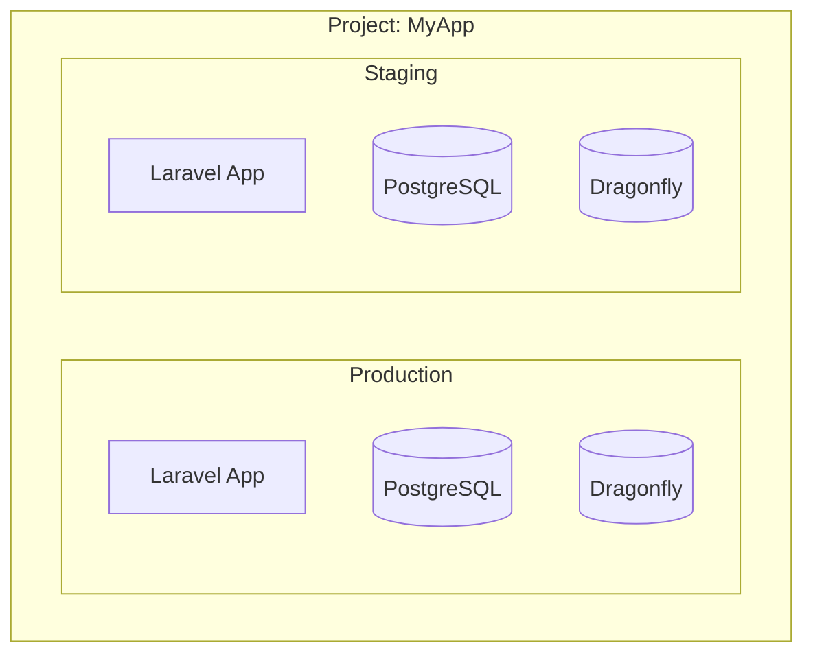

## Single Laravel, Multiple Environments

Use different `.env` files per environment:

```bash
# Staging
php artisan coolify:status --uuid=staging-uuid

# Production
php artisan coolify:status --uuid=prod-uuid
```

## Multiple Apps in One Project

Coolify projects can contain multiple applications:



Provision each environment separately:

```bash
# Production
php artisan coolify:provision \
  --environment=production \
  --branch=main

# Staging
php artisan coolify:provision \
  --environment=staging \
  --branch=develop
```

## Shared Resources

For cost savings, staging can share production's database (separate schema) or use SQLite:

```bash
# Staging with its own smaller resources
php artisan coolify:provision \
  --environment=staging \
  --with-postgres
```

## Dashboard Access

Configure dashboard to show specific environment:

```bash
COOLIFY_APPLICATION_UUID=your-app-uuid
```

Switch environments by updating this value.
