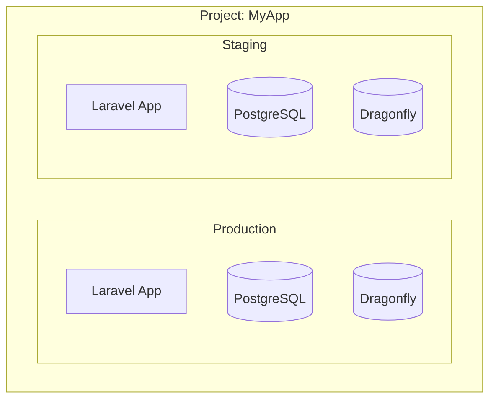

## Environment Support

The dashboard supports multiple environments within a single Coolify project. Use the environment switcher in the sidebar to switch between environments like production, staging, and development.

## Provisioning Environments

Provision separate environments within the same project:

```bash
# Production
php artisan coolify:provision \
  --name="My App" \
  --environment=production \
  --branch=main \
  --all

# Staging
php artisan coolify:provision \
  --name="My App Staging" \
  --environment=staging \
  --branch=develop \
  --all
```

Each environment gets its own application, database, and cache resources.

## Coolify Project Structure



## Dashboard

The dashboard includes an environment switcher in the sidebar. Click on the current environment name to see all available environments and switch between them.

Each environment view shows:
- Application status and deployment history
- Database and cache resources for that environment
- Environment-specific logs and configuration

## CLI Commands with UUID

For CLI operations targeting specific resources, use the `--uuid` flag:

```bash
# Deploy specific application
php artisan coolify:deploy --uuid=staging-app-uuid

# Check specific application status
php artisan coolify:status --uuid=prod-app-uuid

# View specific application logs
php artisan coolify:logs --uuid=staging-app-uuid
```

## View All Resources

```bash
php artisan coolify:status --all
```

Shows all applications and databases across your Coolify instance.
