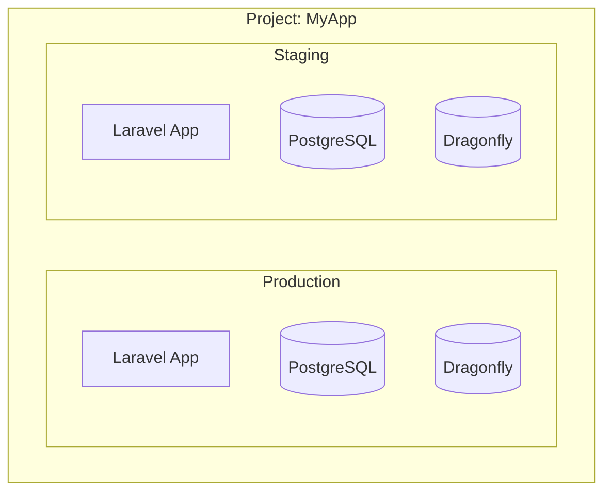

## Multiple Environments

Provision separate environments within the same project:

```bash
# Production
php artisan coolify:provision \
  --name="My App" \
  --environment=production \
  --branch=main \
  --all

# Staging
php artisan coolify:provision \
  --name="My App Staging" \
  --environment=staging \
  --branch=develop \
  --all
```

Each provisioning creates a separate record in `coolify_resources`. The most recent becomes the default.

## Using Specific Resources

Override the default with `--uuid`:

```bash
# Deploy staging
php artisan coolify:deploy --uuid=staging-app-uuid

# Check production status
php artisan coolify:status --uuid=prod-app-uuid

# View staging logs
php artisan coolify:logs --uuid=staging-app-uuid
```

## View All Resources

```bash
php artisan coolify:status --all
```

Shows all applications and databases across your Coolify instance.

## Coolify Project Structure



## Dashboard

The dashboard shows the default resource. To manage multiple environments:

1. Use Coolify's web UI for full environment management
2. Or use `--uuid` flags with artisan commands

The dashboard includes a direct link to the Coolify console for each resource.
