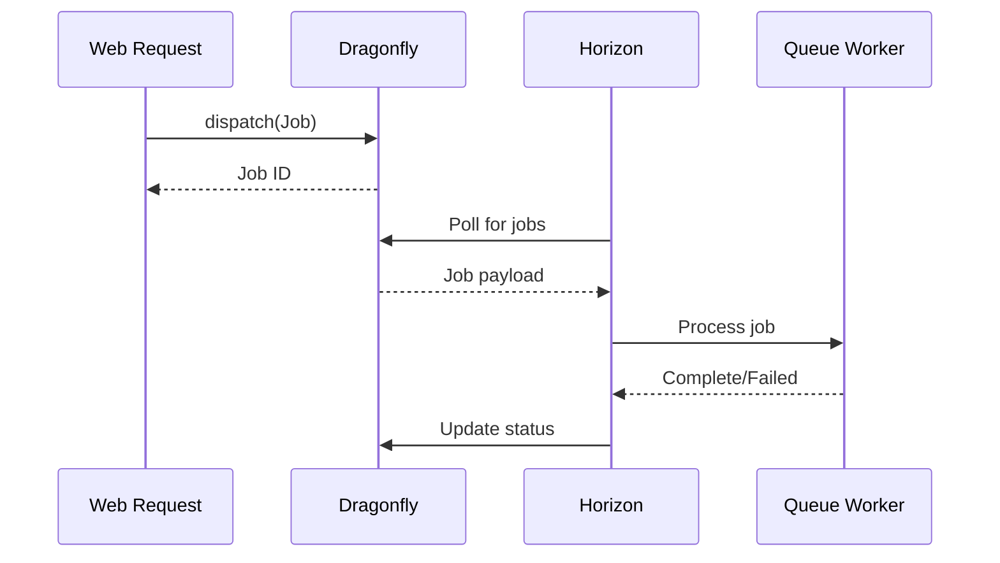

## Queue Flow



## Horizon Configuration

```php
// config/horizon.php
'environments' => [
    'production' => [
        'supervisor-1' => [
            'connection' => 'redis',
            'queue' => ['default', 'high', 'low'],
            'balance' => 'auto',
            'minProcesses' => 1,
            'maxProcesses' => 10,
            'balanceMaxShift' => 1,
            'balanceCooldown' => 3,
            'tries' => 3,
            'timeout' => 60,
        ],
    ],
],
```

## Queue Priority

```php
// High priority - payment processing
dispatch(new ProcessPayment($order))->onQueue('high');

// Default - email notifications
dispatch(new SendWelcomeEmail($user));

// Low priority - analytics
dispatch(new UpdateMetrics($data))->onQueue('low');
```

## Supervisor Integration

Horizon runs as a Supervisor process:

```ini
[program:horizon]
command=/usr/bin/php /var/www/html/artisan horizon
autostart=true
autorestart=true
user=www-data
stopwaitsecs=3600
```

`stopwaitsecs=3600` allows jobs up to 1 hour to complete during deployment.

## Monitoring

Access Horizon dashboard at `/horizon`. Shows:

- Active/pending/completed jobs
- Failed jobs with exception details
- Throughput metrics
- Worker status

## Failed Job Handling

```php
// Retry all failed jobs
php artisan horizon:forget

// Retry specific job
php artisan queue:retry {job-id}

// Clear failed jobs
php artisan queue:flush
```

## Graceful Shutdown

On deployment, Horizon receives SIGTERM:

1. Stops accepting new jobs
2. Completes in-progress jobs (up to stopwaitsecs)
3. Exits cleanly

New container starts fresh Horizon process.
