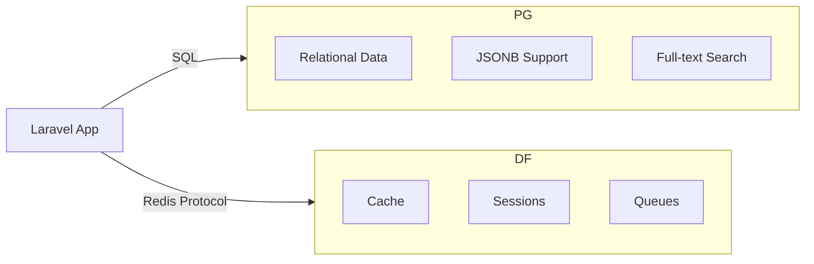

## Stack Components



## PostgreSQL

Full-featured relational database. Handles:
- Application data
- User authentication
- Complex queries with CTEs
- JSONB for flexible schemas
- Full-text search

### Configuration

```bash
DB_CONNECTION=pgsql
DB_HOST=postgres-xxxxx
DB_PORT=5432
DB_DATABASE=app
DB_USERNAME=postgres
DB_PASSWORD=generated
```

### Advantages Over MySQL

| Feature | PostgreSQL | MySQL |
|---------|-----------|-------|
| JSONB performance | Native indexing | Limited |
| CTEs (WITH queries) | Full support | Basic |
| Window functions | Full support | Limited |
| Full-text search | Built-in | Plugin |
| Upserts | ON CONFLICT | REPLACE/INSERT IGNORE |

## Dragonfly

Redis-compatible in-memory store. Drop-in replacement with better performance and lower memory usage.

### Configuration

```bash
REDIS_HOST=dragonfly-xxxxx
REDIS_PORT=6379
REDIS_PASSWORD=generated
CACHE_STORE=redis
SESSION_DRIVER=redis
QUEUE_CONNECTION=redis
```

### Dragonfly vs Redis

| Metric | Dragonfly | Redis |
|--------|-----------|-------|
| Memory efficiency | 25% less | Baseline |
| Throughput | 25x higher | Baseline |
| Multi-threading | Native | Single-threaded |
| Protocol | Redis compatible | - |

### Usage in Laravel

```php
// Cache
Cache::put('key', $value, 3600);

// Sessions (automatic)
// CSRF tokens, flash messages stored in Dragonfly

// Queues
dispatch(new ProcessOrder($order));

// Rate limiting
RateLimiter::for('api', function ($request) {
    return Limit::perMinute(60)->by($request->ip());
});
```

## Backup Strategy

Coolify handles automatic backups for PostgreSQL databases. Dragonfly data is ephemeral (cache/sessions) and doesn't require backup.
