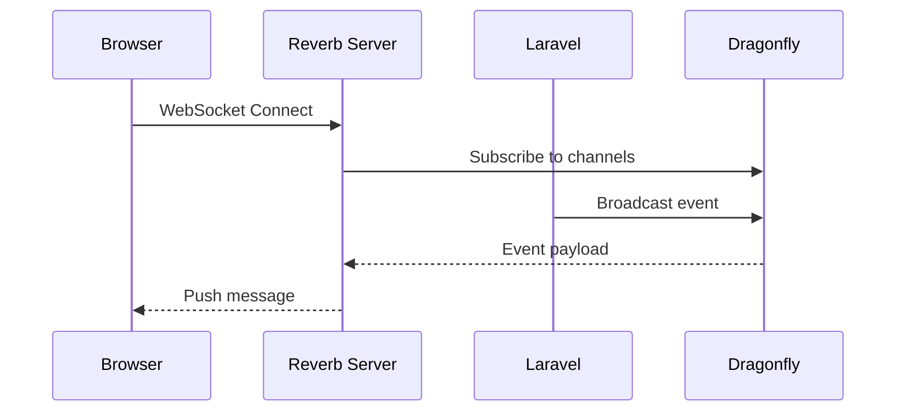

## Connection Flow



## Configuration

Server-side:

```bash
BROADCAST_CONNECTION=reverb
REVERB_APP_ID=generated
REVERB_APP_KEY=generated
REVERB_APP_SECRET=generated
REVERB_HOST=0.0.0.0
REVERB_PORT=8080
REVERB_SCHEME=http
```

Client-side:

```bash
VITE_REVERB_APP_KEY="${REVERB_APP_KEY}"
VITE_REVERB_HOST="${APP_DOMAIN}"
VITE_REVERB_PORT=443
VITE_REVERB_SCHEME=https
```

## Broadcasting Events

```php
// app/Events/OrderShipped.php
class OrderShipped implements ShouldBroadcast
{
    public function __construct(
        public Order $order
    ) {}

    public function broadcastOn(): array
    {
        return [
            new PrivateChannel('orders.'.$this->order->user_id),
        ];
    }
}

// Dispatch
event(new OrderShipped($order));
```

## Client Integration

```javascript
// resources/js/echo.js
import Echo from 'laravel-echo';
import Pusher from 'pusher-js';

window.Pusher = Pusher;
window.Echo = new Echo({
    broadcaster: 'reverb',
    key: import.meta.env.VITE_REVERB_APP_KEY,
    wsHost: import.meta.env.VITE_REVERB_HOST,
    wsPort: import.meta.env.VITE_REVERB_PORT,
    wssPort: import.meta.env.VITE_REVERB_PORT,
    forceTLS: (import.meta.env.VITE_REVERB_SCHEME ?? 'https') === 'https',
    enabledTransports: ['ws', 'wss'],
});
```

## Channel Types

| Type | Auth | Use Case |
|------|------|----------|
| Public | None | Global notifications |
| Private | User auth | User-specific updates |
| Presence | User auth + metadata | Who's online, typing indicators |

## Proxy Configuration

Coolify handles SSL termination. Reverb runs on port 8080 internally, exposed via HTTPS:

```
Client (wss://app.com/app/key) → Coolify Proxy → Reverb:8080
```

## Scaling Considerations

Single Reverb instance handles ~10,000 concurrent connections. For higher loads:

- Run multiple application containers
- Use Redis pub/sub for cross-container communication
- Consider dedicated WebSocket servers
