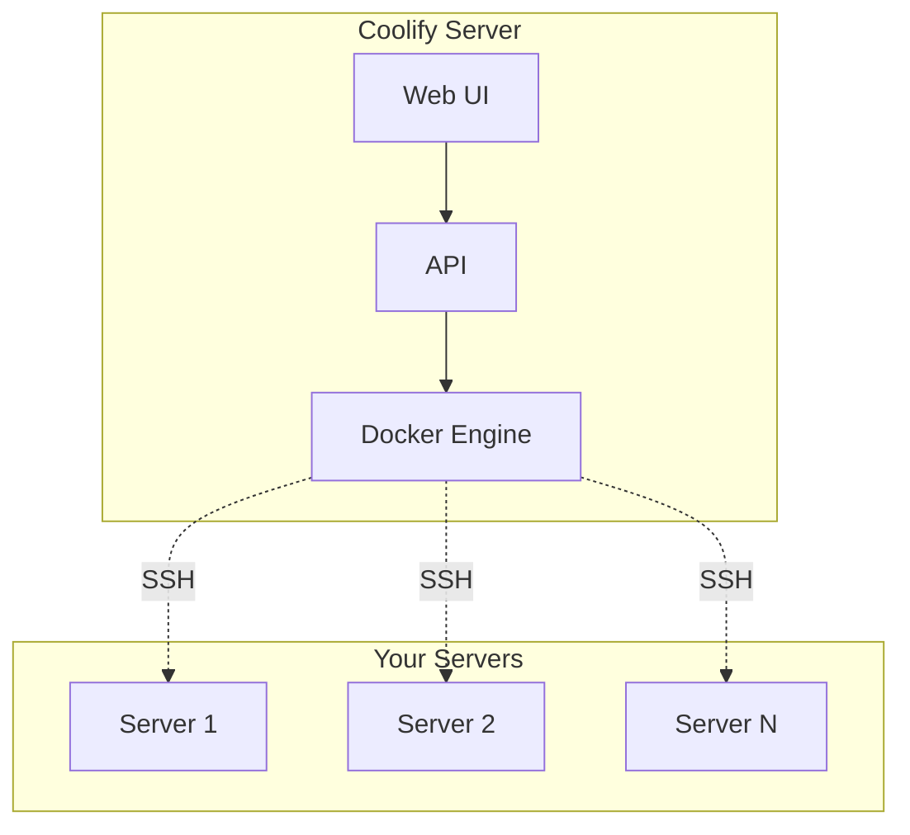

## Platform Comparison

| Feature | Coolify | Forge | Vapor | Render |
|---------|---------|-------|-------|--------|
| Self-hosted | Yes | No | No | No |
| Open source | Yes | No | No | No |
| One-time cost | Yes | Subscription | Pay-per-use | Pay-per-use |
| Docker native | Yes | Limited | Lambda | Yes |
| Database management | Yes | Yes | Aurora | Yes |
| Git integration | Yes | Yes | Yes | Yes |
| SSL/TLS | Auto | Auto | Auto | Auto |
| Wildcard domains | Yes | Yes | Yes | Limited |

## Self-Hosting Benefits

**Data sovereignty**: All data stays on your infrastructure.

**Cost predictability**: Fixed server costs vs variable platform fees.

**No vendor lock-in**: Standard Docker containers run anywhere.

**Full control**: SSH access, custom configurations, any extension.

## Coolify Architecture

Coolify runs on one server and deploys to any number of connected servers via SSH.

## When to Use Coolify

Good fit:
- Teams wanting self-hosted PaaS
- Projects with predictable traffic
- Organizations with data residency requirements
- Developers comfortable with Docker

Consider alternatives:
- Serverless workloads (use Vapor)
- Managed Kubernetes requirements
- Zero-ops preference (use Render/Railway)
