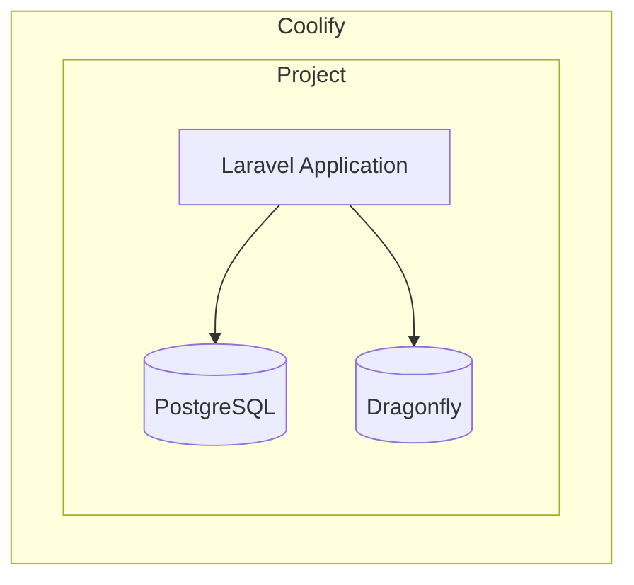

## Prerequisites

Before running provision:

1. Push your code to a Git repository (GitHub, GitLab, etc.)
2. Create an SSH deploy key or GitHub App in Coolify
3. Have a server connected to your Coolify instance

## Run Provision

```bash
php artisan coolify:provision
```

The command will prompt for:
- Server selection
- Project name
- Repository URL
- Branch name
- Deploy key selection

## What Gets Created



Resources created:
- Project and environment in Coolify
- Application with Dockerfile configuration
- PostgreSQL database
- Dragonfly Redis instance
- All environment variables

## After Provision

The command outputs the application UUID. Use it with other commands:

```bash
php artisan coolify:deploy
php artisan coolify:status
php artisan coolify:logs
```

## Trigger Initial Deployment

The provision command sets up infrastructure but doesn't deploy. Trigger deployment:

```bash
php artisan coolify:deploy
```

Or deploy from Coolify dashboard.
