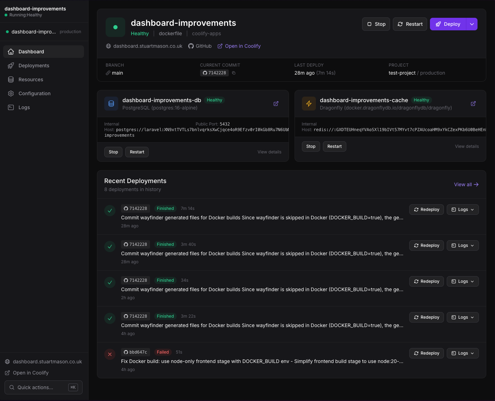

Like [Laravel Horizon](https://laravel.com/docs/horizon), but for your entire infrastructure. Deploy, monitor, and manage your Coolify resources from within your Laravel app.



## Quick Start

```bash
composer require stumason/laravel-coolify
php artisan coolify:install
```

Add to `.env`:

```bash
COOLIFY_URL=https://your-coolify.com
COOLIFY_TOKEN=your-api-token
```

Provision your infrastructure with one command:

```bash
php artisan coolify:provision
```

This creates a Laravel app + PostgreSQL + Dragonfly on Coolify with all environment variables configured automatically.

## Features

- **Dashboard** — Monitor deployments, view logs, manage env vars from `/coolify` in your app
- **Artisan Commands** — Deploy from CI/CD, scripts, or terminal without touching a UI
- **Auto Dockerfiles** — Production-ready Docker config with Horizon, Reverb, and Scheduler detected
- **Full API Access** — Build custom tooling and automations with the complete Coolify API

## Commands

| Command | Description |
|---------|-------------|
| `coolify:install` | Publish config, generate Dockerfile |
| `coolify:provision` | Create infrastructure on Coolify |
| `coolify:deploy` | Trigger deployment |
| `coolify:status` | Show application status |
| `coolify:logs` | View application logs |
| `coolify:restart` | Restart application |
| `coolify:rollback` | Rollback to previous deployment |

## Programmatic API

```php
use Stumason\Coolify\Coolify;

// Quick deploy
Coolify::deploy();

// Full repository access
Coolify::applications()->deploy($uuid, force: true);
Coolify::applications()->envs($uuid);
Coolify::deployments()->forApplication($uuid);
Coolify::databases()->start($uuid);
```

## Requirements

- PHP 8.2+
- Laravel 11 or 12
- Coolify 4.x instance with API access
