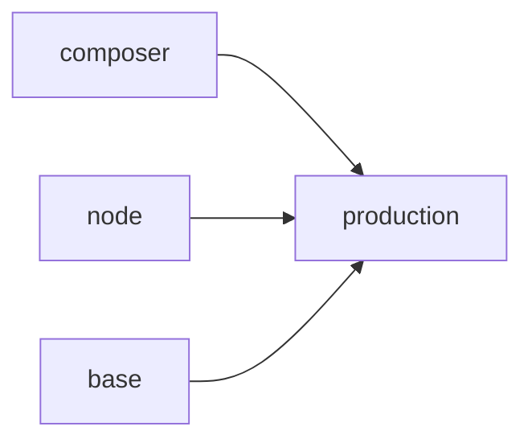

## Build Stages



The Dockerfile uses multi-stage builds to minimize final image size and optimize caching.

## Stage 1: Composer Dependencies

```dockerfile
FROM composer:2 AS composer
WORKDIR /app
COPY composer.json composer.lock ./
RUN composer install --no-dev --no-scripts --no-autoloader --prefer-dist
COPY . .
RUN composer dump-autoload --optimize
```

Installs PHP dependencies with optimized autoloader.

## Stage 2: Node Assets

```dockerfile
FROM node:20-alpine AS node
WORKDIR /app
COPY package*.json ./
RUN npm ci
COPY . .
RUN npm run build
```

Builds frontend assets. Node is not included in final image.

## Stage 3: Base Image

```dockerfile
FROM php:8.3-fpm-alpine AS base
RUN apk add --no-cache \
    nginx \
    supervisor \
    libpq-dev \
    libcap \
    && docker-php-ext-install pdo_pgsql opcache pcntl \
    && pecl install redis && docker-php-ext-enable redis
```

Alpine-based PHP-FPM with required extensions.

## Stage 4: Production

```dockerfile
FROM base AS production
WORKDIR /var/www/html

COPY --from=composer /app/vendor ./vendor
COPY --from=node /app/public/build ./public/build
COPY . .

COPY docker/nginx.conf /etc/nginx/nginx.conf
COPY docker/php.ini /usr/local/etc/php/conf.d/custom.ini
COPY docker/supervisord.conf /etc/supervisord.conf

RUN php artisan config:cache \
    && php artisan route:cache \
    && php artisan view:cache

EXPOSE 80 8080
CMD ["/usr/bin/supervisord", "-c", "/etc/supervisord.conf"]
```

Final image runs Supervisor which manages all processes.

## Image Size

Typical final image size: 150-200MB

Multi-stage builds exclude:
- Composer binary
- Node.js runtime
- npm packages
- Development dependencies
