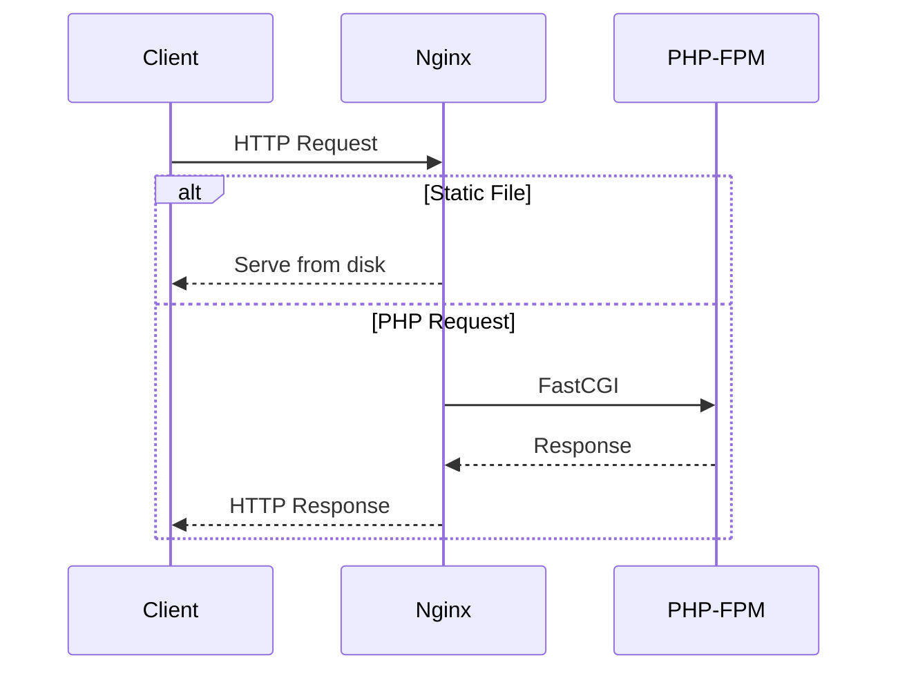

## Request Flow



## Configuration

```nginx
worker_processes auto;
error_log /var/log/nginx/error.log warn;
pid /var/run/nginx.pid;

events {
    worker_connections 1024;
    multi_accept on;
}

http {
    include /etc/nginx/mime.types;
    default_type application/octet-stream;

    log_format main '$remote_addr - $remote_user [$time_local] "$request" '
                    '$status $body_bytes_sent "$http_referer" '
                    '"$http_user_agent" "$http_x_forwarded_for"';

    access_log /var/log/nginx/access.log main;

    sendfile on;
    tcp_nopush on;
    tcp_nodelay on;
    keepalive_timeout 65;
    types_hash_max_size 2048;

    gzip on;
    gzip_vary on;
    gzip_proxied any;
    gzip_comp_level 6;
    gzip_types text/plain text/css text/xml application/json application/javascript
               application/rss+xml application/atom+xml image/svg+xml;

    server {
        listen 80;
        server_name _;
        root /var/www/html/public;
        index index.php;

        client_max_body_size 100M;

        location / {
            try_files $uri $uri/ /index.php?$query_string;
        }

        location = /favicon.ico { access_log off; log_not_found off; }
        location = /robots.txt  { access_log off; log_not_found off; }

        location ~ \.php$ {
            fastcgi_pass 127.0.0.1:9000;
            fastcgi_param SCRIPT_FILENAME $realpath_root$fastcgi_script_name;
            include fastcgi_params;
            fastcgi_hide_header X-Powered-By;
        }

        location ~ /\.(?!well-known).* {
            deny all;
        }

        location ~* \.(js|css|png|jpg|jpeg|gif|ico|svg|woff|woff2)$ {
            expires 1y;
            add_header Cache-Control "public, immutable";
        }
    }
}
```

## Key Settings

| Setting | Value | Purpose |
|---------|-------|---------|
| worker_processes | auto | Match CPU cores |
| worker_connections | 1024 | Max concurrent connections |
| client_max_body_size | 100M | File upload limit |
| gzip | on | Compress responses |
| expires | 1y | Static asset caching |

## Static Asset Caching

Assets with fingerprinted filenames (Vite builds) get 1-year cache headers with `immutable` directive. Browsers won't revalidate these files.
