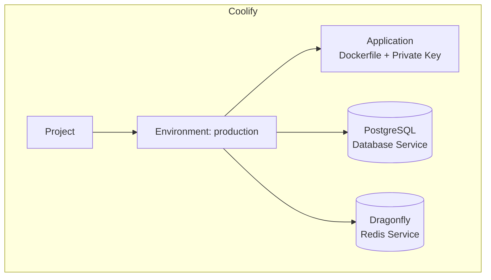
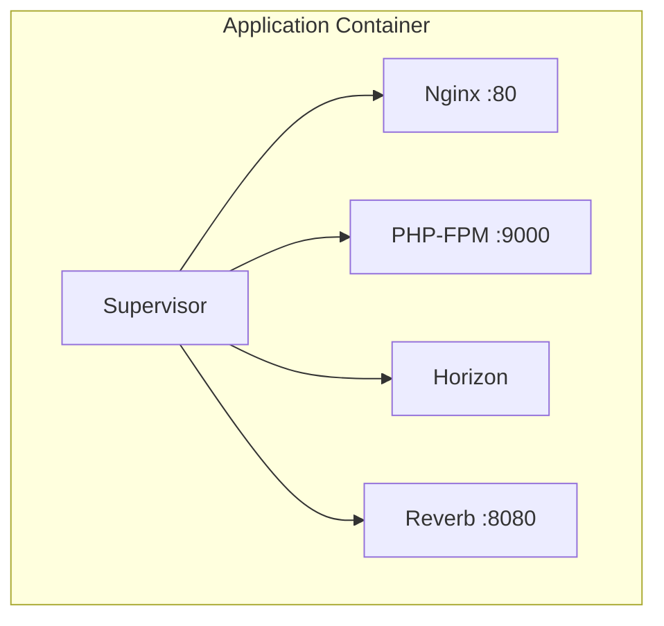

## Coolify Resources

Running `coolify:provision` creates these resources in your Coolify instance:



| Resource | Type | Description |
|----------|------|-------------|
| **Project** | Project | Container for all resources |
| **Environment** | Environment | `production` (multiple environments coming soon) |
| **Application** | Dockerfile App | Your Laravel app, deployed via private GitHub key |
| **PostgreSQL** | Database Service | Relational database |
| **Dragonfly** | Database Service | Redis-compatible cache/queue/sessions |

## What You See in Coolify

After provisioning, your Coolify dashboard shows:

```
Projects
└── your-app-name
    └── production
        ├── your-app-name (Application - Dockerfile)
        ├── your-app-name-postgres (PostgreSQL)
        └── your-app-name-dragonfly (Dragonfly)
```

## Application Configuration

The application is configured as:

- **Build Pack**: Dockerfile
- **Source**: Private GitHub repository
- **Authentication**: SSH deploy key (not GitHub App)
- **Branch**: Your specified branch (default: main)

## Inside the Container

The Dockerfile creates a single container running:



| Process | Purpose |
|---------|---------|
| Nginx | HTTP server, static files |
| PHP-FPM | PHP process manager |
| Horizon | Queue worker |
| Reverb | WebSocket server |

All managed by Supervisor in a single container.
