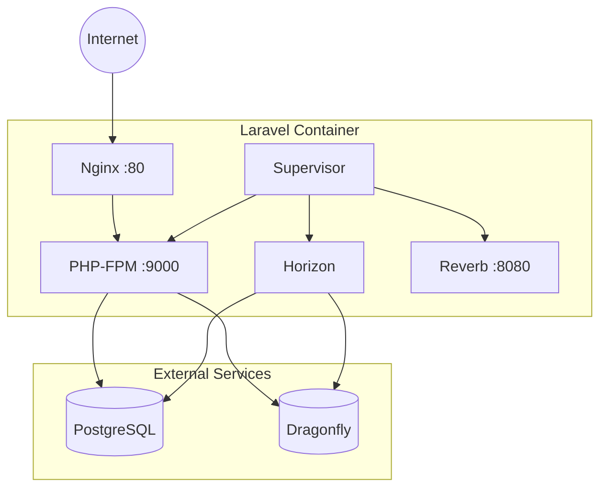

## Architecture



## Components

| Component | Purpose | Port |
|-----------|---------|------|
| Nginx | HTTP server, static files | 80 |
| PHP-FPM | PHP process manager | 9000 |
| Horizon | Queue worker | - |
| Reverb | WebSocket server | 8080 |
| Supervisor | Process manager | - |

## Generated Files

The provision command creates these files in your project:

```
Dockerfile
docker/
├── nginx.conf
├── php.ini
└── supervisord.conf
```

## Single Container

All processes run in one container managed by Supervisor. This simplifies deployment while maintaining process isolation through Supervisor's process groups.
