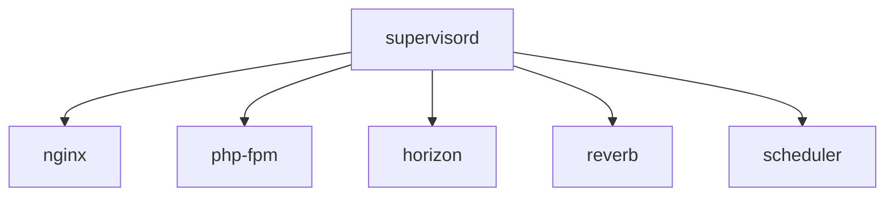

## Process Architecture



Supervisor manages all processes in the container. If any critical process exits, Supervisor can restart it automatically.

## Configuration

```ini
[supervisord]
nodaemon=true
user=root
logfile=/var/log/supervisor/supervisord.log
pidfile=/var/run/supervisord.pid

[program:nginx]
command=/usr/sbin/nginx -g 'daemon off;'
autostart=true
autorestart=true
priority=10
stdout_logfile=/dev/stdout
stdout_logfile_maxbytes=0
stderr_logfile=/dev/stderr
stderr_logfile_maxbytes=0

[program:php-fpm]
command=/usr/local/sbin/php-fpm -F
autostart=true
autorestart=true
priority=5
stdout_logfile=/dev/stdout
stdout_logfile_maxbytes=0
stderr_logfile=/dev/stderr
stderr_logfile_maxbytes=0

[program:horizon]
command=/usr/bin/php /var/www/html/artisan horizon
autostart=true
autorestart=true
user=www-data
redirect_stderr=true
stdout_logfile=/var/www/html/storage/logs/horizon.log
stopwaitsecs=3600

[program:reverb]
command=/usr/bin/php /var/www/html/artisan reverb:start
autostart=true
autorestart=true
user=www-data
redirect_stderr=true
stdout_logfile=/var/www/html/storage/logs/reverb.log

[program:scheduler]
command=/bin/sh -c "while [ true ]; do php /var/www/html/artisan schedule:run --verbose --no-interaction & sleep 60; done"
autostart=true
autorestart=true
user=www-data
redirect_stderr=true
stdout_logfile=/var/www/html/storage/logs/scheduler.log
```

## Process Priority

| Process | Priority | Reason |
|---------|----------|--------|
| php-fpm | 5 | Must start first |
| nginx | 10 | Depends on FPM |
| horizon | 15 | Can start after web |
| reverb | 15 | Can start after web |
| scheduler | 20 | Lowest priority |

## Restart Behavior

- `autorestart=true` - Process restarts if it exits
- `stopwaitsecs=3600` - Horizon gets 1 hour to finish jobs on shutdown
- Logs to stdout/stderr for container log aggregation
